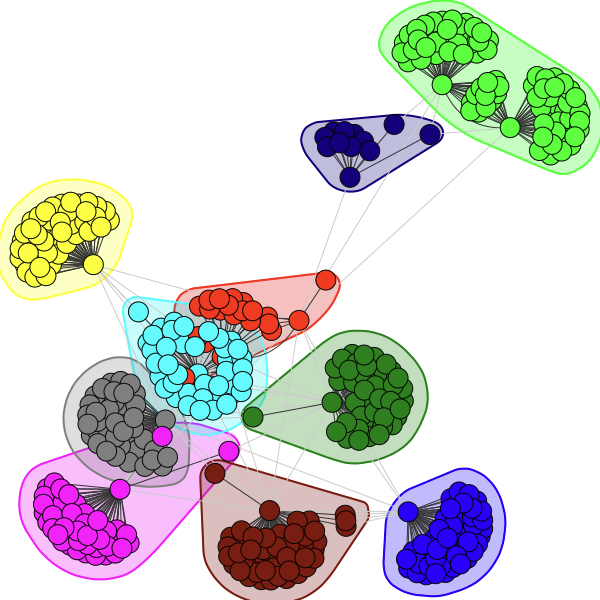
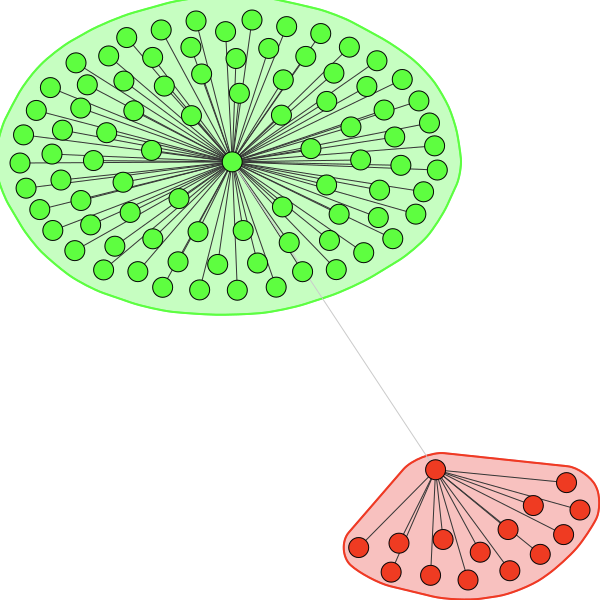

### Network
#### Usage
```python
edges = [(map_id(id1), map_id(id2)) for id1, id2 in user_friends_and_their_friends(default_user_id, max_depth=3)][:500]
network.plot_graph(list(set(edges)))
```
#### Result
depth=3, limit=50



depth=2, limit=100

